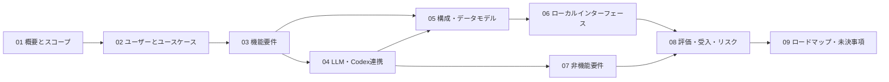

# 対話型AI学習アプリ 要件定義書 — INDEX

## 文書概要

本書群は、ユーザーが教育課程または任意のテーマをLLMと対話しながら学ぶstandaloneデスクトップアプリケーションのMVP要件を定義します。ChatGPTアカウントで認証し、LLM実行基盤には端末内で起動するCodex App Serverを使用します。

## 推奨する読み方

1. プロダクト判断者は [01_概要とスコープ](01_概要とスコープ.md) → [02_ユーザーとユースケース](02_ユーザーとユースケース.md) → [08_品質評価・受入基準・リスク](08_品質評価・受入基準・リスク.md) の順で確認します。
2. UI・アプリ実装者は [03_機能要件](03_機能要件.md) → [06_API](06_API.md) を中心に参照します。
3. LLM・基盤実装者は [04_LLM制御とCodex App Server連携](04_LLM制御とCodex_App_Server連携.md) → [05_システム構成とデータモデル](05_システム構成とデータモデル.md) → [07_非機能要件](07_非機能要件.md) を確認します。
4. 開発計画の策定時は [09_ロードマップと未決事項](09_ロードマップと未決事項.md) を使用します。

## 文書一覧

| 文書 | 内容 | 原要件の章 |
|---|---|---|
| [01_概要とスコープ](01_概要とスコープ.md) | 目的、課題、価値、原則、MVP境界 | 1、2、4 |
| [02_ユーザーとユースケース](02_ユーザーとユースケース.md) | 対象ユーザー、初回・通常・完了フロー | 3、5 |
| [03_機能要件](03_機能要件.md) | 認証、教育課程、根拠資料、学習、履歴の機能要件 | 6 |
| [04_LLM制御とCodex App Server連携](04_LLM制御とCodex_App_Server連携.md) | コンテキスト、構造化出力、App Server接続・イベント | 7、8 |
| [05_システム構成とデータモデル](05_システム構成とデータモデル.md) | 論理構成、正本、主要エンティティ | 9、10 |
| [06_API](06_API.md) | ローカルアプリケーションインターフェース | 11 |
| [07_非機能要件](07_非機能要件.md) | 性能、可用性、セキュリティ、エラー処理 | 12、13 |
| [08_品質評価・受入基準・リスク](08_品質評価・受入基準・リスク.md) | 評価、KPI、受入基準、リスク | 14、15、16、17 |
| [09_ロードマップと未決事項](09_ロードマップと未決事項.md) | 実装フェーズと実装前の決定事項 | 18、19 |

## 文書間の関係

## 共通表記

- Must: MVPで必須です。
- Should: MVP後の早期対応です。
- Could: 将来対応です。
- アプリDB: 学習状態の正本となる端末内のSQLiteデータベースです。
- Thread / Turn / Item: Codex App Serverの会話・処理単位です。
- 教育管轄プロファイル: 国、州、州相当区域など、教育課程・学習標準の発行主体と適用範囲を特定する単位です。MVPでは、公式原資料を取得できた7教育管轄プロファイルを扱います。
- 教育課程: 国・地域、教育段階、学年、教科、版を特定できる公的または準公的な学習体系です。
- 学習目標: `can_do`（できる）または`know`（わかる）のいずれかに分類し、達成を判定する評価証拠を持つ目標です。
- `can_do`: 指定条件のもとで、問題を解く、作成する、操作するなどの観測可能な行動を実行できる状態です。
- `know`: 対象を説明する、区別する、関連付ける、理由を示すなどの観測可能な方法で、知識・理解を示せる状態です。
- Grounded Document: 教育内容の根拠として取得・保存し、出典と取得時点を追跡できる資料です。

## 変更管理

要件IDは文書分割前の識別子を維持します。要件変更時は、関連する受入基準、API、データモデル、非機能要件との整合性も同時に確認します。
