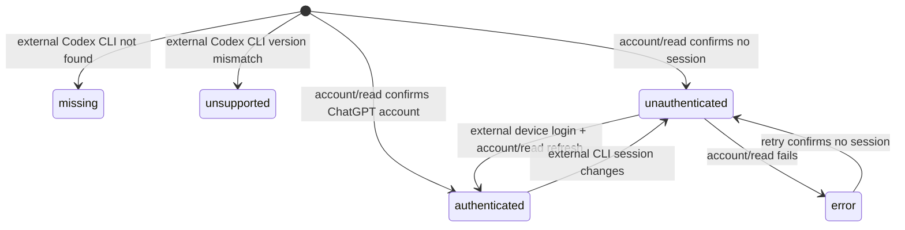

# Hackathon Submission UI and Codex Login Design

Status: Focused surface, boundary decisions, final visual evidence, packaged artifact, and external-CLI acceptance
are complete. The PO approved focused option A, macOS arm64 option 1, and boundary options
1A, 2A, 3A, and 4A on 2026-07-21.

Last updated: 2026-07-22 JST

## 1. Objective and observable success

LearnStepper must present a submission-ready learning experience without exposing engineering or
product-management terminology. A first-time user must install Codex CLI 0.144.5, authenticate it with
`codex login --device-auth`, open the packaged desktop app, confirm that LearnStepper recognizes the
existing session, create a free-topic learning project, and use AI conversation.

Observable success is:

1. Every launch begins with adult self-attestation. The Renderer does not resolve its Host Bridge and Electron
   does not start the sidecar, database, Codex, or account-status read before confirmation.
2. No user-facing screen contains `PO保留`, `FE-PO-*`, `NIF-*`, `Application Core`, `Local Core`,
   `Core unavailable`, `Concrete host`, or `Bridge接続`.
3. Curriculum-aligned learning is absent from the submission UI and is documented as a Future Update.
4. Selecting **ログイン状態を再確認** performs only `account/read`; LearnStepper never starts a browser login.
5. Login success is accepted only after `account/read` confirms the external CLI session.
6. A restart reuses Codex-managed credentials from the CLI's configured storage. Tokens never enter Renderer
   state, IPC responses, application logs, SQLite, or browser storage.
7. The packaged app starts the Renderer and local service without system `uv` or Python commands, and starts
   App Server from the separately installed Codex CLI.

## 2. Product language and information hierarchy

Design thesis: a focused Japanese desktop learning companion that feels calm and complete by showing
one clear learning action at a time, while describing local and AI availability in user language.

The primary journey is:

1. Adult self-attestation
2. Local profile
3. External Codex CLI login confirmation
4. Free-topic project creation
5. Learning conversation
6. Saved history and progress

Internal language is replaced at the presentation boundary only:

| Internal term | User-facing treatment |
|---|---|
| `Application Core` | `この端末` or `ローカルデータ`, according to context |
| `Local Core` | `ローカルデータ利用可能` |
| `Core unavailable` | `ローカル機能を利用できません` |
| `App Server` | `AI接続` |
| `Bridge接続` | `デスクトップアプリ` |
| `PO保留`, `FE-PO-*`, `NIF-*` | Not rendered |
| `Concrete host` | Not rendered |

Unavailable implementation work is not explained with internal hold notices. A capability that is not
part of the confirmed submission MVP is removed from navigation. A temporary failure in a supported
capability uses an actionable loading, offline, or error state.

## 3. Curriculum Future Update boundary

The following PO decision is fixed for the hackathon submission: curriculum-aligned learning is a
Future Update.

Submission UI changes:

- project creation uses free-topic mode only;
- jurisdiction and curriculum selectors are not rendered;
- curriculum progress metrics and curriculum mapping tables are not rendered;
- curriculum-specific source wording is not rendered;
- existing curriculum schema, import code, structured data, and persistence remain intact for a future
  release unless they prevent standalone packaging.

This is a presentation and MVP-scope change, not a destructive data migration.

## 4. Runtime and authentication responsibilities

| Responsibility | Owner | Trigger |
|---|---|---|
| Detect packaged runtime | Electron main process | Application startup |
| Start local service | Electron main process | Successful eligibility confirmation |
| Detect external Codex CLI | Electron main process | Post-confirmation startup |
| Start pinned Codex App Server | Local service | External CLI found |
| Read authentication state | Codex gateway | Post-confirmation startup and explicit refresh |
| Start device login | User in Terminal | Before launch or while login guidance is visible |
| Verify account | Codex gateway | `account/read` on startup or **ログイン状態を再確認** |
| Cache and refresh tokens | External Codex CLI | CLI login and later authenticated requests |
| Render state and actions | Renderer | Host status/event changes |

The Renderer receives authentication state only. It does not receive an access token, refresh token,
raw account payload, raw login response, or arbitrary URL.

## 5. Authentication state model

Supported CLI states are `missing`, `unsupported`, `available`, and `checking`. Supported authentication
states are `unauthenticated`, `authenticated`, `checking`, and `error`.

UI behavior:

- the refresh action is disabled while `account/read` is in progress;
- local profile and saved local data remain available while unauthenticated;
- missing and unsupported CLI states have distinct installation guidance;
- authentication status is read after application restart and on explicit refresh;
- LearnStepper does not open a browser, own a login transaction, or receive login URLs.

## 6. Approved MVP surface and remaining PO review

These items must not be removed merely to make the interface look complete. The recommended submission
choice was approved for this submission. The retained items still require PO acceptance review of the
observable product behavior before release.

| Item | Recommended submission choice | Trade-off |
|---|---|---|
| Learning objectives | Keep | Product differentiation; requires authoritative objective data |
| Learning plan | Keep only when an actionable saved/generated plan exists | An empty read-only plan makes the app look unfinished |
| Initial diagnosis | Hide | Valuable later, but generation and scoring are not connected |
| Exercises, final assessment, remediation | Hide | Central to a full learning product, but disabled controls harm submission quality |
| Sources and grounding | Keep only when real citations are available | Trust benefit versus an empty or misleading source screen |
| Progress | Keep without curriculum metrics | Demonstrates continuity if backed by saved evidence |
| Session history | Keep | Proves local persistence and supports returning learners |
| Notes and bookmarks | Keep only after end-to-end verification | Useful but secondary to the learning loop |
| Archive | Keep | Reversible project management action |
| Project deletion | Keep only with accurate deletion-scope copy | Irreversible and currently does not guarantee Codex-thread deletion |
| All-local-data deletion | Hide | Scope and credential deletion semantics are unresolved |

Approved option A is the focused submission surface: profile, Codex login, free-topic creation,
learning objectives, actionable plan, AI conversation, evidence-backed progress, history, verified notes
and bookmarks, settings, and archive. Unsupported or empty surfaces are absent rather than labelled as
held.

## 7. Packaging design

The final desktop artifact includes the self-contained LearnStepper local service, standalone Renderer,
and structured application resources. It deliberately does not bundle Codex CLI.

Verified submission environment and artifact:

- host: macOS 26.5.2 on arm64;
- required external AI runtime: official `codex-cli 0.144.5`;
- packaged runtime: bundled PyInstaller sidecar; external Codex resolved from documented user/system paths;
- Finder-equivalent smoke test: no system `uv` or Python required; missing Codex preserves local data and shows guidance;
- signing: ad-hoc deep signature verified with `codesign --verify --deep --strict`;
- Developer ID signing/notarization: not configured because no Developer ID identity is available in this environment.

The PO selected option A for external CLI ownership. Distribution alternatives are:

1. **macOS arm64 plus external Codex CLI (approved):** ship the verified LearnStepper app and require
   Codex CLI 0.144.5 for AI features. This avoids depending on another app's private resources and callback owner.
2. **Bundle Codex per platform:** larger artifact and duplicated credential/login lifecycle; not selected.
3. **Direct API integration:** different authentication, billing, and product architecture; Future Update only.

Development and packaged mode resolve an external `codex` from `~/.local/bin`, `~/.npm-global/bin`,
Homebrew/system locations, and inherited `PATH`. LearnStepper preserves configured `CODEX_HOME` and does
not override Codex credential storage, so the CLI and LearnStepper App Server share the same session. Command-line
overrides clear `mcp_servers`, pin `model_provider="openai"`, disable analytics, remote plugins, skill dependency
installation, memories, and project instructions, and retain the existing shell/browser/Web/tool denials.

Startup distinguishes a missing CLI, an unsupported CLI version, and an App Server launch failure. Each condition
disables AI conversation without disabling local profile, project, or history access. App Server initialization
still requires exact version 0.144.5 before the AI capability becomes available.

## 8. Security boundaries

- Require login through the official external CLI, recommending `codex login --device-auth`.
- Do not implement custom OAuth, open provider login URLs, or register a callback scheme in LearnStepper.
- Do not report success before `account/read` confirms a ChatGPT account shape.
- Do not store tokens in SQLite, browser storage, environment dumps, crash reports, or IPC frames.
- Preserve the external CLI's configured credential storage and `CODEX_HOME`.
- Preserve the existing empty-tool and default-deny Codex capability boundary.

Grounding policy for the hackathon MVP:

- Web search and new Web retrieval are disabled;
- the source list displays only material already stored on the device;
- the learning and objective/source views state that no Web search or new retrieval occurs;
- tutor replies are not represented as restricted to, or cited from, saved material until the NIF-003/NIF-023 work is complete;
- Web search and retrieval remain a Future Update.

Additional focused-MVP decisions:

- display at most five saved learning objectives; objective generation and versioned rubrics remain a Future Update;
- display an existing active learning plan read-only; draft, review, approval, and completeness gates remain a Future Update;
- retain local storage and existing individual deletion only; all-data deletion, export, backup, retention, and encryption policy remain a Future Update.
- limit the MVP to adult learners aged 18 or older and state that medical, legal, and financial topics are outside the submission scope; this is acknowledgement copy and does not apply keyword or classifier rejection;
- send no external telemetry or crash reports and retain only local diagnostic logs;
- provide code explanation, examples, and review without executing learner code; local and remote execution sandboxes remain a Future Update.
- expose only the four versioned conversation actions: explain more simply, give an example, check understanding, and return to the lesson; these actions do not create a persistent detour state;
- hide remediation proposals and flows; rejection, acceptance, completion, and return-to-lesson semantics remain a Future Update.

Approved eligibility, objective-limit, and project-ownership behavior:

- render an adult-eligibility gate as the first application screen on every launch;
- keep the acknowledgement in Renderer process memory only and do not resolve the Renderer Host Bridge before acknowledgement;
- expose a confirmation-only preload capability before acknowledgement; Electron starts the sidecar and permits all other host IPC only after confirmation succeeds;
- keep initialization failures retryable on the same confirmation screen without exposing host diagnostics;
- describe the gate as self-attestation, not identity or age verification, and state that medical, legal, and financial topics are excluded;
- enforce the five-active-objective limit for new objectives at the Application Core create boundary rather than truncating Renderer output;
- active-objective revision remains allowed; invalidated-objective reactivation is rejected when five or more active objectives already exist;
- retain and return legacy over-limit active objectives without deleting or truncating them, while blocking new creation and invalidated reactivation until the count falls below five;
- reject creation of a sixth active objective while allowing a new version of an existing objective.
- on project A→B selection, show the B shell immediately, hide A-owned data and actions, and load B workspace,
  attainment, and saved-source regions independently; ignore late A responses.

## 9. Verification plan

TDD specifications precede implementation for:

1. forbidden internal UI terminology and removed curriculum controls;
2. external CLI authentication refresh, error recovery, and restart reuse;
3. proof that LearnStepper has no browser-login, callback, or arbitrary-URL opening path;
4. token and account-payload non-disclosure across IPC and Renderer boundaries;
5. no Renderer Host Bridge resolution or Renderer profile/project/authentication query before adult self-attestation, plus reappearance after application restart;
6. no sidecar, database, Codex, or account I/O before adult self-attestation; protected IPC is denied, confirmation is idempotent, failed initialization is retryable, and a new process resets acknowledgement;
7. successful creation through five active objectives, rejection of a sixth, permitted active revision, and the approved invalidated-reactivation policy;
8. packaged executable resolution with no system `uv` or Python dependency and documented external Codex discovery;
9. external Codex missing and pinned-version mismatch states;
10. keyboard focus, disabled/loading states, screen-reader status updates, and reduced motion;
11. build, typecheck, lint, frontend tests, Python tests, desktop transport tests, and packaged smoke tests.

Current evidence on 2026-07-22 JST: Host eligibility tests, focused Renderer/service tests,
objective transition tests, the production build, ESLint, TypeScript, scoped Ruff, and mypy passed.
The final suites report 52 Node tests, 74 Frontend tests, and 101 Python tests; 227/227 passed. The independently managed video package also reports 9/9 tests.
The additional frontend-to-Python boundary test submits the generated `project.create` payload to the production Core,
and the Codex fixture now uses the production `Codex Desktop/0.144.5` initialize User-Agent.
The option-A DMG was rebuilt at 214,957,076 bytes with SHA-256
`02cd11562acffbdb779e1c5b74769ed414405a9eb5fbc6b0d8b0c5b4b1d1b2a9`. `hdiutil verify` reported VALID,
the mounted application passed deep ad-hoc signature verification, the sidecar was executable, and no Codex binary
was embedded.
The previous bundled-runtime artifact evidence is superseded by option A. The rebuilt application launched its
loopback Renderer and bundled sidecar, resolved external Codex CLI 0.144.5, read its existing session, and preserved
local-only operation when the CLI was missing. Thirty-two durable captures cover the focused routes/states at
1440px, 768px, 320px, 200% zoom, reduced motion, visible keyboard focus, and restart persistence. CDP measurements
confirmed no horizontal overflow at 768px/320px, an active reduced-motion media query with near-zero transition
duration, and a `3px solid` focus ring after Tab. Representative captures: [adult 320×900](evidence/adult-eligibility-320x900.png),
[installed login-required state](evidence/installed-login-required-1440x900.png),
[installed project at 320px](evidence/installed-project-created-320x900.png),
[installed keyboard focus](evidence/installed-keyboard-focus-1440x900.png), and
[installed restart persistence](evidence/installed-project-persisted-after-restart-1440x900.png),
[external-CLI authenticated settings](evidence/option-a-settings-authenticated-1440x928.png),
[real AI response](evidence/option-a-real-ai-response-1440x928.png), and
[final MCP-isolated AI response](evidence/option-a-final-mcp-isolated-ai-response-1440x928.png), and
[final restart/reconciliation proof](evidence/option-a-final-restart-reconciled-ai-response-1440x928.png), and
[restart authentication reuse](evidence/option-a-restart-auth-reuse-1440x928.png).

Focused-MVP implementation traceability:

| Retained behavior | Implementation | Automated/visual evidence |
|---|---|---|
| Adult self-attestation before Renderer Host Bridge resolution | `EligibilityGate` and process-local root state | Renderer boot/getter tests, SSR test, 1440px and 320px captures |
| No-Web-search/source-list boundary notice | `GroundingPolicyNotice` on learning and objective views | Renderer presentation test |
| New objective creation capped at five active items; Renderer never truncates Core output | Application Core create boundary and `ObjectiveSummary` | Core contract test for five creates, sixth rejection, revision; Renderer defensive-overflow test |
| Existing active plan is read-only | Learning and plan presentation | Renderer project-data and presentation tests |
| Existing local storage and scoped deletion only | Project settings and Core transaction | Renderer deletion test and Core lifecycle test |
| Four versioned conversation actions only | `QUICK_ACTIONS` and conversation coordinator | Renderer event test and conversation contract tests |
| Diagnosis, assessment, and remediation absent | Focused navigation and route guards | Deferred-screen renderer test |
| No external telemetry or learner-code execution | No telemetry/execution surface or command in the focused Renderer | Contract and forbidden-surface tests |

Completed focused PO acceptance: the external CLI login was detected, the first real AI learning response completed,
the application was restarted, and LearnStepper reused both its local conversation and the external CLI session. The
final rebuilt DMG also completed a fresh real response after two-phase MCP isolation and startup capability checks.

## 10. Rejected alternatives

- Bundling Codex in the DMG: rejected after callback ownership was observed to resolve to the installed ChatGPT app;
  it also duplicated a large runtime and credential lifecycle.
- Reusing the Codex binary inside ChatGPT.app: rejected because it is a private, version-unstable application resource
  and does not expose a supported third-party integration contract.
- Starting App Server browser login from LearnStepper: rejected because the `codex://` callback is owned by the
  installed ChatGPT app rather than LearnStepper's subprocess.
- Implementing independent ChatGPT OAuth: rejected because Codex owns supported authentication and token
  refresh.
- Storing tokens in LearnStepper SQLite or Renderer storage: rejected because it duplicates credential
  ownership and expands exposure.
- Keeping disabled placeholder screens with renamed hold notices: rejected because terminology cleanup alone
  does not create a complete submission experience.
- Rewriting the local service in Node solely to reduce packaging work: deferred because it expands scope and
  risks replacing already-tested application behavior.
- Retaining project A until every project B request completes: rejected because the slowest region would block
  the whole switch and simultaneous selected/displayed ownership would keep stale A actions available.
