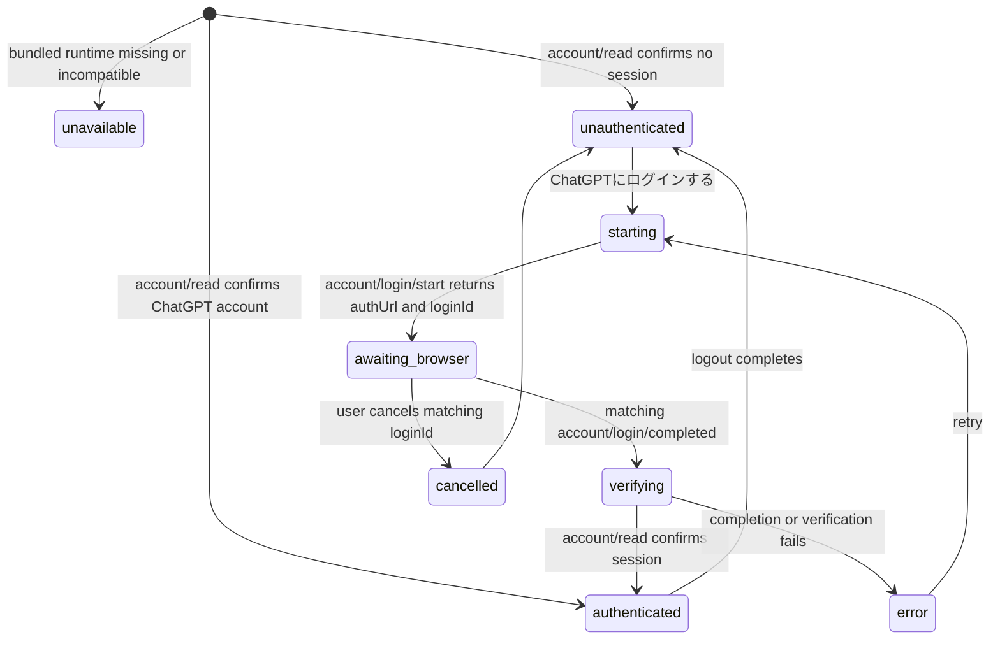

# Hackathon Submission UI and Codex Login Design

Status: Implemented and locally verified. The PO approved focused option A and macOS arm64 option 1
on 2026-07-21.

Last updated: 2026-07-21

## 1. Objective and observable success

LearnStepper must present a submission-ready learning experience without exposing engineering or
product-management terminology. A first-time user must be able to open the packaged desktop app,
select **ChatGPTにログインする**, complete the Codex browser login, return to an authenticated app,
create a free-topic learning project, and use AI conversation without installing Codex separately.

Observable success is:

1. No user-facing screen contains `PO保留`, `FE-PO-*`, `NIF-*`, `Application Core`, `Local Core`,
   `Core unavailable`, `Concrete host`, or `Bridge接続`.
2. Curriculum-aligned learning is absent from the submission UI and is documented as a Future Update.
3. Selecting **ChatGPTにログインする** starts the Codex App Server login flow and opens only a
   validated official HTTPS login URL in the system browser.
4. Login success is accepted only after the matching `account/login/completed` notification and a
   successful `account/read` verification.
5. A restart reuses Codex-managed credentials from local secure storage. Tokens never enter Renderer
   state, IPC responses, application logs, SQLite, or browser storage.
6. The packaged app starts the Renderer, local service, and Codex App Server without system `codex`,
   `uv`, or Python commands.

## 2. Product language and information hierarchy

Design thesis: a focused Japanese desktop learning companion that feels calm and complete by showing
one clear learning action at a time, while describing local and AI availability in user language.

The primary journey is:

1. Local profile
2. ChatGPT login through Codex
3. Free-topic project creation
4. Learning conversation
5. Saved history and progress

Internal language is replaced at the presentation boundary only:

| Internal term | User-facing treatment |
|---|---|
| `Application Core` | `この端末` or `ローカルデータ`, according to context |
| `Local Core` | `ローカルデータ利用可能` |
| `Core unavailable` | `ローカル機能を利用できません` |
| `App Server` | `AI接続` |
| `Bridge接続` | `デスクトップアプリ` |
| `PO保留`, `FE-PO-*`, `NIF-*` | Not rendered |
| `Concrete host` | Not rendered |

Unavailable implementation work is not explained with internal hold notices. A capability that is not
part of the confirmed submission MVP is removed from navigation. A temporary failure in a supported
capability uses an actionable loading, offline, or error state.

## 3. Curriculum Future Update boundary

The following PO decision is fixed for the hackathon submission: curriculum-aligned learning is a
Future Update.

Submission UI changes:

- project creation uses free-topic mode only;
- jurisdiction and curriculum selectors are not rendered;
- curriculum progress metrics and curriculum mapping tables are not rendered;
- curriculum-specific source wording is not rendered;
- existing curriculum schema, import code, structured data, and persistence remain intact for a future
  release unless they prevent standalone packaging.

This is a presentation and MVP-scope change, not a destructive data migration.

## 4. Runtime and authentication responsibilities

| Responsibility | Owner | Trigger |
|---|---|---|
| Detect packaged runtime | Electron main process | Application startup |
| Start local service | Electron main process | Application startup |
| Start pinned Codex App Server | Local service | Local service startup |
| Read authentication state | Codex gateway | Startup and login completion |
| Start browser login | Codex gateway | User selects **ChatGPTにログインする** |
| Validate and open login URL | Electron main process | Gateway returns `authUrl` |
| Track `loginId` | Local service only | `account/login/start` response |
| Receive completion | Codex gateway | `account/login/completed` notification |
| Verify account | Codex gateway | Matching successful completion notification |
| Cache and refresh tokens | Codex | Login and later authenticated requests |
| Render state and actions | Renderer | Host status/event changes |

The Renderer receives authentication state only. It does not receive an access token, refresh token,
raw account payload, raw login response, or arbitrary URL.

## 5. Authentication state model

Supported states are `unavailable`, `unauthenticated`, `starting`, `awaiting_browser`, `verifying`,
`authenticated`, `cancelled`, and `error`.

UI behavior:

- the login action is disabled during `starting`, `awaiting_browser`, and `verifying`;
- local profile and saved local data remain available while unauthenticated;
- browser-open failure leaves the user on a retryable error state;
- completion for another or expired `loginId` cannot authenticate the current attempt;
- authentication status is re-read after completion and after application restart;
- login and cancellation remain responsive while no conversation request is running.

## 6. Approved MVP surface and remaining PO review

These items must not be removed merely to make the interface look complete. The recommended submission
choice was approved for this submission. The retained items still require PO acceptance review of the
observable product behavior before release.

| Item | Recommended submission choice | Trade-off |
|---|---|---|
| Learning objectives | Keep | Product differentiation; requires authoritative objective data |
| Learning plan | Keep only when an actionable saved/generated plan exists | An empty read-only plan makes the app look unfinished |
| Initial diagnosis | Hide | Valuable later, but generation and scoring are not connected |
| Exercises, final assessment, remediation | Hide | Central to a full learning product, but disabled controls harm submission quality |
| Sources and grounding | Keep only when real citations are available | Trust benefit versus an empty or misleading source screen |
| Progress | Keep without curriculum metrics | Demonstrates continuity if backed by saved evidence |
| Session history | Keep | Proves local persistence and supports returning learners |
| Notes and bookmarks | Keep only after end-to-end verification | Useful but secondary to the learning loop |
| Archive | Keep | Reversible project management action |
| Project deletion | Keep only with accurate deletion-scope copy | Irreversible and currently does not guarantee Codex-thread deletion |
| All-local-data deletion | Hide | Scope and credential deletion semantics are unresolved |

Approved option A is the focused submission surface: profile, Codex login, free-topic creation,
learning objectives, actionable plan, AI conversation, evidence-backed progress, history, verified notes
and bookmarks, settings, and archive. Unsupported or empty surfaces are absent rather than labelled as
held.

## 7. Packaging design

The final desktop artifact must include platform-specific runtime resources:

- pinned Codex 0.144.5 executable;
- self-contained LearnStepper local service binary;
- standalone Renderer;
- structured application resources required by retained MVP features.

Verified submission environment and artifact:

- host: macOS 26.5.2 on arm64;
- Codex: `codex-cli 0.144.5`, arm64 Mach-O standalone executable, approximately 248 MB;
- Codex dynamic dependencies: macOS system frameworks and system libraries only;
- artifact: `release/LearnStepper-mac-arm64.dmg`, 313,145,973 bytes (approximately 299 MiB);
- artifact SHA-256: `25205d6fc673afa3f418631c88547d3c6bed4d41983ef290f48ac793963b52ff`;
- packaged runtime: bundled Codex 0.144.5 arm64 and bundled PyInstaller sidecar;
- Finder-equivalent smoke test: success with `PATH=/usr/bin:/bin` and no system `uv`, Python, or Codex;
- signing: ad-hoc deep signature verified with `codesign --verify --deep --strict`;
- Developer ID signing/notarization: not configured because no Developer ID identity is available in this environment.

The PO selected option 1. Other options remain Future Update candidates:

1. **macOS arm64 only (recommended for the current submission):** bundle the verified arm64 Codex
   executable and produce a matching arm64 DMG. This is the shortest path to a verified standalone
   artifact on the available machine.
2. **macOS universal:** obtain and verify both arm64 and x64 Codex executables and build universal
   application resources. This increases artifact size substantially and requires x64 verification.
3. **macOS, Windows, and Linux:** obtain, pin, checksum, package, and verify a Codex executable and
   local-service binary for every OS/architecture pair. This is appropriate for a later release, not an
   unverified hackathon claim.

Development may resolve repository tools, but packaged mode must resolve only bundled executable paths.
The app uses an application-owned `CODEX_HOME` under Electron `userData`. Codex credential storage is
configured as `keyring` so the OS credential store is used without plaintext fallback. Other Codex state
may remain under the application-owned local directory.

The packaged-runtime resolver must reject a missing, non-executable, wrong-platform, or version-mismatched
Codex resource with an actionable user-facing AI connection error. It must not silently fall back to an
arbitrary executable found on `PATH` in packaged mode.

## 8. Security boundaries

- Use `account/login/start` with `{type: "chatgpt"}`; do not implement custom OAuth or accept tokens in UI.
- Open only `https:` URLs whose normalized host belongs to the explicit OpenAI/ChatGPT login allow-list.
- Keep the login URL out of durable logs and Renderer-visible diagnostics.
- Correlate completion with the active `loginId`.
- Do not report success before `account/read` confirms a ChatGPT account shape.
- Do not store tokens in SQLite, browser storage, environment dumps, crash reports, or IPC frames.
- Configure Codex credential storage to use the OS keyring and fail closed if unavailable.
- Preserve the existing empty-tool and default-deny Codex capability boundary.

## 9. Verification plan

TDD specifications precede implementation for:

1. forbidden internal UI terminology and removed curriculum controls;
2. the exact login state transitions, retry, cancel, stale completion, and restart reuse;
3. official HTTPS login URL validation and arbitrary URL rejection;
4. token and account-payload non-disclosure across IPC and Renderer boundaries;
5. packaged executable resolution with no `PATH`, `uv`, Python, or system Codex dependency;
6. pinned Codex version mismatch and missing-resource failure;
7. keyboard focus, disabled/loading states, screen-reader status updates, and reduced motion;
8. build, typecheck, lint, frontend tests, Python tests, desktop transport tests, and packaged smoke tests.

Verification evidence on 2026-07-21: Node contract/package tests 38/38, frontend tests 46/46,
Python full regression 82/82, ESLint, TypeScript, scoped Ruff, and mypy all passed. The DMG checksum and
embedded ad-hoc signature passed verification. The packaged application launched its loopback Renderer and bundled sidecar;
the bundled Codex 0.144.5 arm64 executable and packaged authentication flow were verified independently.
Real `login → cancel → status` produced `awaiting_browser → unauthenticated`; the official login URL was
redacted from evidence. Desktop and 720 px responsive visual checks passed.

Remaining PO acceptance target: complete the browser login with the PO account, confirm the first AI
learning response, restart the application, and confirm that Codex reuses the keyring-backed session.

## 10. Rejected alternatives

- Requiring users to install Codex CLI separately: rejected because it contradicts standalone submission.
- Running `codex login` in a visible terminal: rejected because App Server exposes a structured login API
  and terminal lifecycle is not a product UI.
- Implementing independent ChatGPT OAuth: rejected because Codex owns supported authentication and token
  refresh.
- Storing tokens in LearnStepper SQLite or Renderer storage: rejected because it duplicates credential
  ownership and expands exposure.
- Keeping disabled placeholder screens with renamed hold notices: rejected because terminology cleanup alone
  does not create a complete submission experience.
- Rewriting the local service in Node solely to reduce packaging work: deferred because it expands scope and
  risks replacing already-tested application behavior.
