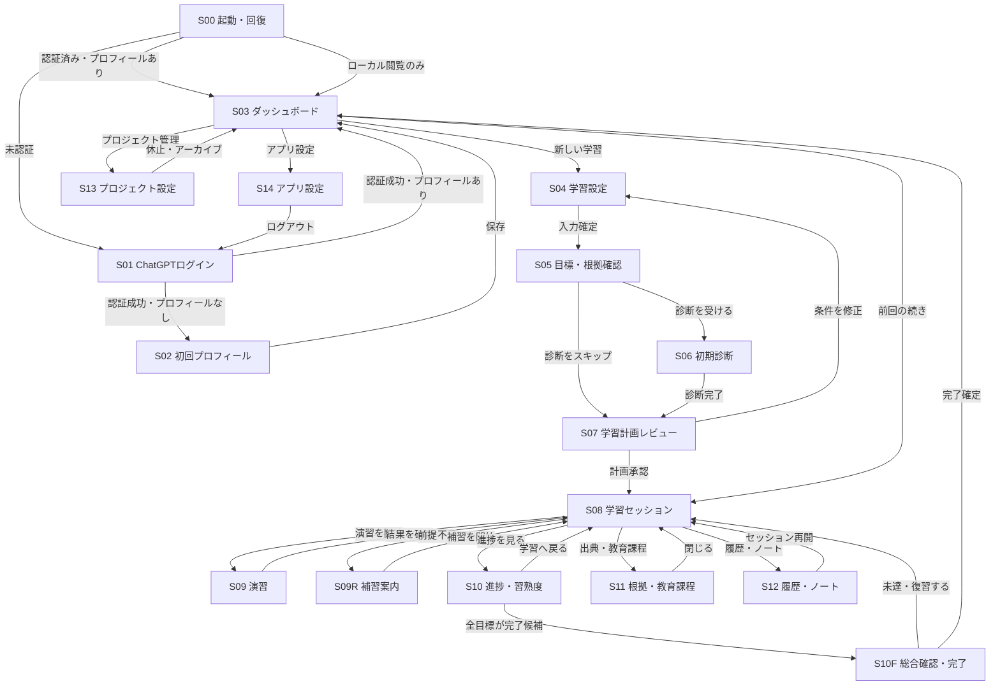
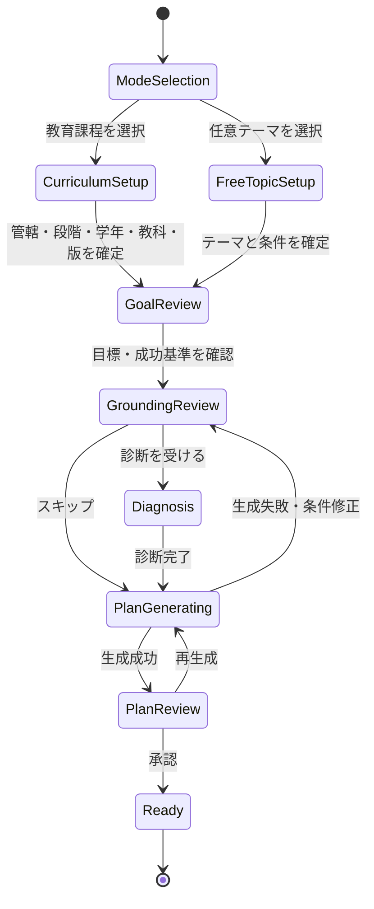
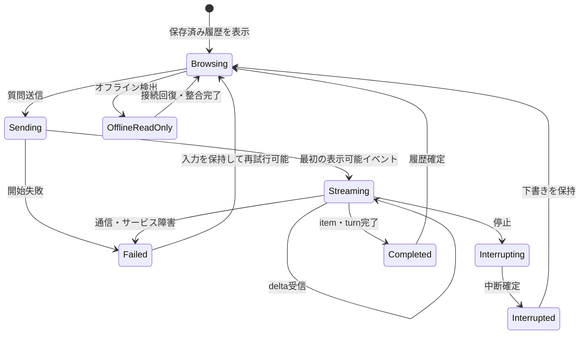
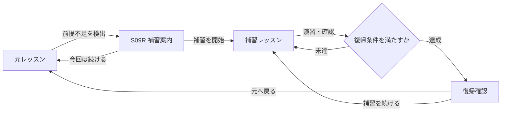
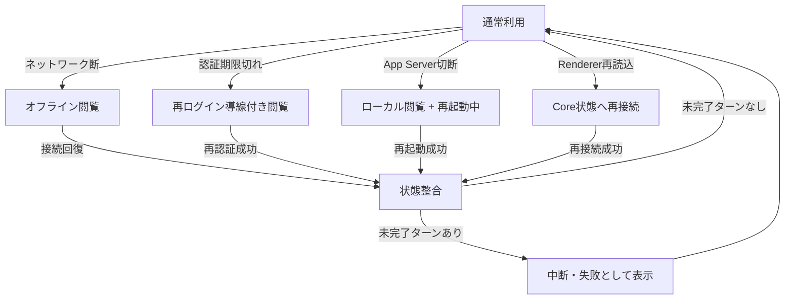

# LearnStepper MVP 画面・画面遷移設計

## 1. 設計の位置づけ

対象は standalone デスクトップアプリの MVP です。設計根拠は派生元 worktree に未コミットで配置されている `ai-learning-app-requirements/` の要件書です。

本件は単なる画面実装ではなく、学習開始、LLM の非同期応答、補習、進捗更新、オフライン復旧を横断する設計問題として扱います。

### 観測可能な達成条件

ユーザーが、起動から学習開始、対話、演習、補習、再開、完了まで迷わず移動でき、どの画面でも「現在地」「今回の目標」「次にできること」「出典の状態」を確認できることです。

### MVPの前提

- OSユーザー単位の単一ローカルプロフィールです。
- 学習プロジェクトは「教育課程に沿う」と「任意テーマ」の2種類です。
- 学習状態の正本はローカルDBであり、Codexの会話履歴だけに依存しません。
- オフライン時も保存済みデータは閲覧できますが、認証、生成、未取得資料の取得は利用不能です。
- ChatGPTログアウトとローカル学習データ削除は別操作です。
- デスクトップの標準幅では3ペインまで使用し、狭い幅では補助ペインをドロワーへ退避します。

## 2. 情報アーキテクチャ

常設のグローバルナビゲーションは、主要なユーザー目的に限定します。

| ナビゲーション | 目的 | 主な遷移先 |
|---|---|---|
| ホーム | 学習を再開・新規作成する | S03 ダッシュボード |
| 学習 | 選択中プロジェクトの現在レッスンへ戻る | S08 学習セッション |
| 進捗 | 習熟度、目標達成証拠、補習状況を確認する | S10 進捗・習熟度 |
| ライブラリ | 根拠資料、教育課程項目、ノートを確認する | S11 根拠・教育課程 / S12 履歴・ノート |
| 設定 | プロフィール、認証、データを管理する | S14 アプリ設定 |

選択中プロジェクトにだけ属する「計画」「履歴」「プロジェクト設定」は、グローバル項目にせずプロジェクト内ナビゲーションに置きます。

## 3. 画面インベントリ

### 起動・認証

| ID | 画面 | 主責務 | 主要表示・操作 | 主な状態 |
|---|---|---|---|---|
| S00 | 起動・回復 | ローカルDB、App Server、前回処理の整合 | 起動段階、回復結果、再試行、保存済みデータのみ開く | 初期化中、回復中、利用可能、部分利用、起動失敗 |
| S01 | ChatGPTログイン | 認証の開始と完了待ち | ログイン、ブラウザを再度開く、認証状態更新 | 未認証、ブラウザ待ち、認証済み、期限切れ、失敗 |
| S02 | 初回プロフィール | 端末内プロフィールの初期設定 | 表示名、言語、タイムゾーン、説明の好み | 未入力、入力中、保存済み |

### ホーム・プロジェクト作成

| ID | 画面 | 主責務 | 主要表示・操作 | 主な状態 |
|---|---|---|---|---|
| S03 | ダッシュボード | 継続学習とプロジェクト管理の起点 | 前回の続き、次の推奨、進行中・休止中プロジェクト、新規作成 | 通常、初回空状態、オフライン、アーカイブ表示 |
| S04 | 学習設定 | 学習モード、対象、目的、条件の設定 | 教育課程／任意テーマ、目的、レベル、期間、1回時間、前提、除外 | 入力中、検証エラー、保存済み |
| S05 | 目標・根拠確認 | 最終目標と学習根拠の合意 | `できる`／`わかる`目標、成功基準、評価方法、教育課程、主要資料 | 取得中、確認可能、資料不足、版不明、矛盾あり |
| S06 | 初期診断 | 現在理解と前提不足の測定 | 問題、進捗、回答、スキップ、診断結果 | 未開始、回答中、採点中、完了、スキップ |
| S07 | 学習計画レビュー | 生成計画の確認・編集・承認 | モジュール、レッスン、前提関係、時間、目標、出典、編集 | 生成中、レビュー中、再生成中、承認済み、生成失敗 |

### 学習・評価

| ID | 画面 | 主責務 | 主要表示・操作 | 主な状態 |
|---|---|---|---|---|
| S08 | 学習セッション | 対話を中心にレッスンを進める | 現在地、今回目標、会話、クイック操作、入力、停止、出典 | 閲覧中、送信中、生成中、停止済み、失敗、オフライン |
| S09 | 演習 | 学習目標に対応する評価証拠を取得 | 問題、回答、ヒント、採点、改善点、次の問題 | 出題中、回答中、採点中、正答、不正解、採点保留 |
| S09R | 補習案内 | 前提不足と復帰条件を明示 | 戻る理由、補う概念、補習レッスン、元の位置、復帰条件 | 提案、補習中、復帰可能 |
| S10 | 進捗・習熟度 | 学習成果と次の行動を説明 | 目標別状態、証拠、概念習熟度、教育課程到達、苦手、次回推奨 | 通常、補習中、完了候補、データ不足 |
| S10F | 総合確認・完了 | プロジェクト完了を検証 | 総合テスト、目標別達成度、証拠、苦手、復習案、完了操作 | 受験中、採点中、未達、達成、完了 |

### 参照・管理

| ID | 画面 | 主責務 | 主要表示・操作 | 主な状態 |
|---|---|---|---|---|
| S11 | 根拠・教育課程 | 主張、資料、教育課程項目の対応確認 | 資料メタデータ、信頼区分、引用、版、取得時点、対応項目 | 検証済み、未検証、取得失敗、版不明、矛盾あり |
| S12 | 履歴・ノート | 過去セッションと保存情報の再利用 | セッション履歴、要約、会話、ブックマーク、ノート | 一覧、詳細、空状態 |
| S13 | プロジェクト設定 | 個別プロジェクトの変更・終了管理 | 名称、目標、計画再生成、休止、アーカイブ、削除 | 通常、再生成中、確認待ち |
| S14 | アプリ設定 | プロフィール、認証、ローカルデータ管理 | 認証状態、ログアウト、表示設定、診断ログ、全データ削除 | 通常、未認証、確認待ち、処理中 |

## 4. 画面責務の境界

### S03 ダッシュボード

- 「何を学ぶか」ではなく「次に何をするか」を最上位に表示します。
- 前回位置、前回要約、次の推奨、プロジェクト進捗を一つの再開カードにまとめます。
- 個別レッスンの詳細、根拠資料、習熟度の詳細は持ち込みません。
- 新規ユーザーには空の一覧ではなく、学習モードの違いを示す開始導線を表示します。

### S05 目標・根拠確認

- 教育課程学習では、管轄種別、発行主体、教育段階、学年、教科、版を省略しません。
- MVPで選択可能な管轄は、日本、コロンビア特別区、ニューヨーク州、カリフォルニア州、ベルリン州、ハンブルク州、バイエルン州の固定7地域です。
- UAEは公式一次資料を安定取得できないためMVP対象外とし、選択肢へ表示しません。
- コロンビア特別区を州と表示しません。
- 最終目標ごとに `できる` または `わかる` の一方、成功基準、評価証拠の取得方法を表示します。
- 根拠資料が未検証、取得失敗、版不明、相互矛盾の場合は、検証済みと同じ見た目にしません。

### S08 学習セッション

デスクトップ標準幅では次の3領域です。

1. 左ペイン: モジュール、レッスン、現在位置、補習経路。
2. 中央ペイン: 前回要約、会話、演習導線、入力、生成停止。
3. 右ペイン: 今回の学習目標、成功基準、達成証拠、出典、教育課程項目。

入力検知、表示状態、通信、進捗確定を分離します。

| 契機 | 即時表示 | バックグラウンド処理 | 確定契機 |
|---|---|---|---|
| 質問送信 | ユーザー発言と送信中状態 | LLMターン開始 | `item/completed`で履歴確定 |
| delta受信 | 応答本文へ追記 | 受信継続 | `item/completed`で表示内容確定 |
| 停止 | 停止要求中 | `turn/interrupt` | `interrupted`で停止済み確定 |
| 演習完了 | 結果と根拠を表示 | 習熟度更新候補を計算 | 検証後に進捗へ反映 |
| 前提不足検出 | 補習提案を独立表示 | 補習経路候補を生成 | ユーザー選択後に経路開始 |

通信や根拠資料取得の完了を待ってからユーザー入力を表示する設計にはしません。

### S09 演習

- レッスン画面内の軽い確認はインラインで表示し、複数問・自由記述・総合確認は専用画面へ遷移します。
- 採点結果は点数だけでなく、満たした観点、不足観点、根拠、改善点を表示します。
- 採点不能・曖昧な回答は不正解へ自動分類せず、採点保留として扱います。
- ヒント回数を達成証拠へ反映しますが、ユーザーには罰点のように見せません。

### S09R 補習案内

- 補習を通常レッスンの失敗状態として表示しません。
- 「なぜ戻るか」「何を補うか」「どこへ戻るか」「何ができれば復帰するか」を同時に表示します。
- 元の学習位置を常に保持し、補習完了後は自動遷移ではなく復帰確認を行います。

## 5. 主要画面遷移

## 6. 新規学習作成フロー

S04からS07は「戻ると入力が失われるウィザード」ではなく、一つの作成ドラフトを複数画面で編集する構造です。自動保存したドラフトをS03から再開できます。

### 戻る操作の保持規則

| 戻り元 | 戻り先 | 保持する内容 |
|---|---|---|
| S05 | S04 | 全入力、取得済み根拠候補、編集済み最終目標 |
| S06 | S05 | 回答済み診断、スキップ状態、診断開始時の設定版 |
| S07 | S05 | 計画案、生成条件、ユーザー編集、生成失敗理由 |
| S08 | S07 | 承認済み計画を表示。変更時は新バージョンとして扱う |

## 7. 学習セッション内の状態遷移

### 状態別の操作可否

| 状態 | 閲覧 | 入力編集 | 新規送信 | 停止 | 根拠の既存閲覧 |
|---|:---:|:---:|:---:|:---:|:---:|
| 閲覧中 | 可 | 可 | 可 | 不可 | 可 |
| 送信中・生成中 | 可 | 次の下書きのみ可 | 不可 | 可 | 可 |
| 停止要求中 | 可 | 可 | 不可 | 不可 | 可 |
| 失敗 | 可 | 可 | 再試行可 | 不可 | 可 |
| オフライン | 可 | 可・端末保存 | 不可 | 不可 | 取得済みのみ可 |
| 認証期限切れ | 可 | 可・端末保存 | 不可 | 不可 | 取得済みのみ可 |

## 8. 補習と復帰の遷移

補習中は、S08左ペインとS10の両方で次を固定表示します。

- 元の学習位置。
- 補習へ移った理由。
- 現在補っている概念。
- 復帰条件と現在の達成状況。

## 9. 障害・オフライン時の遷移

障害は全画面を一律にエラー画面へ置き換えません。影響範囲ごとに状態を分離します。

### 表示原則

- オフライン、認証切れ、App Server切断を同じ「接続エラー」にまとめません。
- 既存の計画、進捗、履歴、取得済み資料は閲覧可能なままにします。
- 失敗したターンの入力と未送信下書きを保持します。
- 再試行可能時刻がある場合は具体的に表示します。
- 内部エラーコードではなく、影響範囲と次に可能な操作を表示します。

## 10. 破壊的操作の確認画面

確認ダイアログは対象と影響範囲を区別します。

| 操作 | 認証情報 | 学習データ | 根拠資料 | Codexスレッド | 画面上の必須説明 |
|---|---:|---:|---:|---:|---|
| ChatGPTログアウト | 削除 | 保持 | 保持 | 保持 | 再ログインまで生成不能 |
| プロジェクトをアーカイブ | 保持 | 保持 | 保持 | アーカイブ | 復元可能 |
| プロジェクトを削除 | 保持 | 対象分削除 | 共有参照がなければ削除候補 | 削除またはアーカイブ | 通常一覧・履歴から消える |
| 全ローカルデータ削除 | 削除 | 全削除 | 全削除 | 全削除 | 復旧不能、対象一覧を表示 |

削除確認は単純な「よろしいですか」ではなく、対象一覧、保持されるデータ、復旧可否を表示します。

## 11. 画面と要件の対応

| 画面 | 主要要件 | 受入基準 |
|---|---|---|
| S00・S01・S02 | FR-A01〜A07、NFR 2・3・9 | AC-00、AC-06 |
| S03 | FR-P07、FR-M01・M06、FR-H02・H04 | AC-03、AC-05 |
| S04・S05 | FR-P01〜P12、FR-G01・G04・G07・G08・G11〜G13 | AC-01、AC-08〜AC-10 |
| S06 | FR-D01〜D08 | AC-01、AC-10 |
| S07 | FR-L01〜L14 | AC-01、AC-05、AC-10 |
| S08 | FR-C01〜C15 | AC-02、AC-03、AC-06、AC-08 |
| S09 | FR-Q01〜Q12 | AC-04、AC-10 |
| S09R | FR-L10、FR-C14、FR-M09 | AC-05 |
| S10・S10F | FR-M01〜M10、FR-Q08 | AC-04、AC-05、AC-10 |
| S11 | FR-G03〜G10、G13 | AC-02、AC-08、AC-09 |
| S12 | FR-N01〜N06、FR-H01〜H03 | AC-03 |
| S13・S14 | FR-P06・P07、FR-H04・H05、FR-A02〜A04 | AC-07 |

## 12. プロトタイプ優先順位

画面遷移と中核体験を検証する順序です。

1. **P0: S03 → S08 → S09 → S10**
   再開、対話、演習、進捗という通常利用の中核を検証します。
2. **P0: S04 → S05 → S06 → S07 → S08**
   初回作成と計画承認までの認知負荷を検証します。
3. **P0: S08 → S09R → S08**
   補習理由と元位置への復帰が理解できるか検証します。
4. **P1: S00 → S01 → S02 → S03**
   起動、認証、初回導入を検証します。
5. **P1: S11・S12**
   出典、教育課程、履歴、ノートの参照性を検証します。
6. **P1: S13・S14**
   ログアウトと削除の違いが誤解されないか検証します。

最初の高忠実度プロトタイプはS08単体ではなく、S03からS08へ再開し、S09で演習し、S10へ結果が反映される一連の遷移を対象にします。

## 13. POレビューで確認する事項

1. グローバルナビゲーションが5項目で十分か。
2. S08の3ペイン構成で、会話と現在目標の両方を追いやすいか。
3. `できる`／`わかる`、成功基準、評価証拠の表現が直感的か。
4. 補習中でも元の学習位置と復帰条件を見失わないか。
5. オフライン、認証切れ、App Server切断の違いを理解できるか。
6. ログアウト、アーカイブ、個別削除、全削除の影響範囲を誤認しないか。
