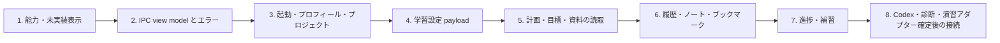

# 画面プロトタイプとバックエンドの整合レビュー

作成日: 2026-07-18
更新日: 2026-07-19
対象画面: `origin/main` の画面プロトタイプ

実装状況: 2026-07-20に契約優先Rendererへ反映済み。下表の「現状」はレビュー時点の旧プロトタイプを示し、実装証拠は `FRONTEND_IMPLEMENTATION_PLAN.md` 14節に集約しています。
対象バックエンド: `fix/pr4-review-findings` のApplication Coreと会話gateway
比較対象: 両者を同一ブランチへ統合した時点のスナップショット

## 1. 結論

画面プロトタイプの情報設計と、バックエンドのドメインモデルには共通点があります。一方、画面プロトタイプはApplication Coreへ未接続であり、保留中の外部連携・AI機能をデモ内で「利用可能で成功する機能」として表現しています。会話transportは実装済みですが、画面とConcrete Rendererは未接続です。

最優先の修正方針は次のとおりです。

1. 保留中の機能を、実装済み機能と同じ見た目・遷移にしないこと。
2. 学習設定を `project.create` の必須入力へ合わせること。
3. 計画承認、対話、演習、補習、進捗の各状態を、バックエンドが現在保証する状態と、将来のアダプターが担う状態に分けること。
4. プロジェクト、履歴、ノート、ブックマークなど、バックエンドで利用可能な機能を画面へ追加すること。

## 2. 判定基準

優先度は以下です。

| 優先度 | 意味 |
|---|---|
| P0 | 現状のまま接続すると、成功していない処理を成功したように見せる、またはIPC契約に適合しない箇所 |
| P1 | バックエンドで実装済みの主要機能が画面にない、または状態・データの意味が異なる箇所 |
| P2 | 接続後の操作性、復旧性、保守性を高めるために必要な箇所 |

## 3. 修正箇所一覧

### P0: 接続前に解消すべき不一致

| ID | 対象画面・実装箇所 | 現状 | バックエンド上の事実 | 画面プロトの修正案 | 確認条件 |
|---|---|---|---|---|---|
| UI-BE-001 | S05〜S09、S14。`SetupFlow`、`TutorConversation`、`ExerciseScreen`、`SettingsScreen` | 根拠取得、AI診断、計画生成、ライブ対話、生成停止、問題生成・採点、ChatGPT認証、全ローカルデータ削除が成功する体験になっています。 | 会話transportと型付きRenderer契約はNIF-006として実装済みです。一方、ChatGPT login、根拠取得、AI診断・計画・演習、完全削除、Concrete Renderer、教育的AI挙動はNIF-001〜005、NIF-007、NIF-009、NIF-022〜026、およびinterface-level hold listで保留中です。 | 全機能を `デモ` または `未接続` として明示します。接続モードでは実装済み会話IPCだけを型付きイベントに接続し、保留機能は無効化して `NOT_IMPLEMENTED` を通常の失敗として表示します。 | デモモードではデータが保存されないことを明示します。接続済みIPCから成功確認を受けていない処理を、完了・保存・達成済みと表示しません。 |
| UI-BE-002 | S04 学習設定。`SetupDraft`、`SetupFlow` | 教育課程モードでは目的、現在レベル、目標レベル、目標日、前提知識、利用条件、除外条件が入力されません。`free` という値もIPC値と異なります。 | `project.create` は `mode`、`title`、`topic`、`purpose`、`curriculum_id`、`current_level`、`target_level`、`target_date`、`preferred_session_minutes`、`constraints` を全て必須とします。モード値は `curriculum` / `free_topic` です。 | 不足フィールドを追加し、画面値からIPC値への変換表を定義します。管轄キーではなく、`curriculum.list` が返す `curriculum_id` を保持します。自由テーマの `curriculum_id` は `null` にします。 | 入力から、未知フィールドを含まない有効な `project.create` payloadを組み立てられます。両モードの契約テスト用fixtureを作成できます。 |
| UI-BE-003 | S04・S05。`JURISDICTION_PROFILES`、`sourcesForDraft` | 学年、教科、版、資料、検証済み状態を画面側で固定し、全7地域の受入組合せが確定済みのように見えます。 | 7地域のプロフィール自体は実装済みですが、受入対象となる教育段階・学年・教科・版の最終組合せは NIF-012、完全な教育課程目標・前提関係は NIF-018、選定根拠の構造化は NIF-019 で保留中です。 | 地域一覧、教育課程、項目、資料は `curriculumProfile.*`、`curriculum.*`、`source.*` の応答から表示します。未確定の組合せは「代表データ」「受入組合せ未確定」と表示し、製品保証と混同させません。 | ハードコードされた学年・版を根拠に「検証済み」と表示しません。バックエンドの7地域だけが選択肢に現れます。 |
| UI-BE-004 | S07 学習計画レビュー。`SetupFlow` の `plan` step | 画面上の「計画を承認して始める」で、生成・完全性検証・承認が一度に完了します。 | `plan.generate` は保留中です。実装済みの `plan.update` は計画を直接 `active` として保存します。ドラフト、レビュー、承認の状態遷移と、全レッスンに目標があることを保証する完全性ゲートは NIF-020 で未確定です。 | 「生成中」「レビュー中」「承認済み」を現行IPCへ無理に対応付けません。現段階ではデモ表示とし、接続モードでは外部で作成済みの計画を `plan.getCurrent` で閲覧する画面に限定します。承認操作は計画ライフサイクル契約の確定後に接続します。 | `plan.update` 成功だけを「ユーザー承認済み」と表示しません。目標なしの計画を開始可能にしません。 |
| UI-BE-005 | S08 学習セッション。`GenerationState`、`TutorConversation` | `sending → streaming → completed`、`interrupting → stopped`、切断時の `failed` を画面内タイマーだけで成立させ、質問・回答を保持済みとして表示します。 | `session.start/resume/get/complete`、`message.send`、`turn.steer/interrupt`、Item単位Fork、型付きイベント、同一ID再開、reconciliationは実装済みです。ただしConcrete Renderer、App Server supervisor、教育的応答品質はNIF-022、NIF-023、NIF-025、NIF-026として保留中です。 | 永続セッション状態と生成ターン状態を別モデルにし、画面内タイマーではなく型付きイベントを正本にします。completed itemだけを確定履歴として表示し、停止要求と停止確認、再接続とreconciliation conflictを別状態で扱います。 | タイマー経過だけで回答完了や保存済みを表示しません。再起動後もLearningSession IDとThread IDを維持します。停止、Fork、競合を契約どおりに画面で識別できます。 |
| UI-BE-006 | S09 演習。`ExerciseScreen` | 画面内の選択肢判定直後に「評価証拠として記録」「進捗へ反映」と表示します。 | `assessment.generate` とAI採点は保留中です。`assessment.submitAttempt` は、Application Core内で事前作成された assessment と、その時点の objective version にしか証拠を紐付けられません。自己申告だけでは達成になりません。assessment作成は現行IPCに公開されていません。 | 「ローカル練習結果」と「達成に採用された評価証拠」を分離します。現段階の問題はデモと表示し、保存・達成を断言しません。接続時は assessment ID、objective version、採点状態、`accepted_for_attainment`、不採用理由を表示できる結果モデルへ変更します。 | `assessment.submitAttempt` の成功前に記録済みと表示しません。不採用証拠が達成数や習熟度を増加させません。 |
| UI-BE-007 | S14 アプリ設定。`SettingsScreen` | 全ローカルデータ削除で、計画、進捗、履歴、資料、認証情報を削除対象として一括表示します。 | 現行実装が保証するのは `project.delete` によるプロジェクト所有データの削除と最小tombstoneです。認証、Codex状態、キャッシュ、ログ、ドラフト、スナップショット等を含む完全削除は NIF-002 で保留中です。 | 「このプロジェクトを削除」と「全ローカルデータを削除」を別操作にします。前者だけを現行IPCへ接続し、後者は未実装として無効化します。削除確認には対象範囲と復元不能を列挙します。 | 完全削除未実装の状態で「全て削除しました」と表示しません。`project.delete` 後は復元導線を表示しません。 |

### P1: 実装済みバックエンド機能を画面へ反映する修正

| ID | 対象画面・実装箇所 | 現状 | バックエンド上の事実 | 画面プロトの修正案 | 確認条件 |
|---|---|---|---|---|---|
| UI-BE-008 | S00〜S03。`Screen`、初期表示、`Dashboard` | 起動直後に固定データ入りダッシュボードを表示し、初回プロフィール、初期化失敗、空状態がありません。 | `profile.get/update`、`project.list/get` は実装済みです。プロフィール未作成時は `NOT_FOUND` になり得ます。 | 起動ロード画面を追加し、`profile.get` と `project.list` の結果から、初回プロフィール、空状態、通常ダッシュボードへ分岐します。認証画面は保留中であることを別に示します。 | 初期DB、プロフィールのみ、プロジェクトあり、読込失敗の4状態を操作確認できます。 |
| UI-BE-009 | S03・S13。`Dashboard`、未実装のプロジェクト設定 | 単一の固定プロジェクトだけを表示し、休止、完了、アーカイブ、復元、プロジェクト編集がありません。 | `project.list/get/update/archive/restore/delete` と `active / paused / completed / archived` の状態遷移は実装済みです。 | プロジェクト一覧とプロジェクト設定を追加します。進行中、休止中、完了、アーカイブを分け、許可された操作だけを表示します。アーカイブ一覧は `include_archived` を使います。 | 各状態で不正な操作が表示されないか、`INVALID_STATE_TRANSITION` として回復可能に表示されます。 |
| UI-BE-010 | S05・S11。`Source`、`SourceDialog`、`sourcesForDraft` | 発行主体、取得時点、URL非表示、引用範囲、検証状態を画面側の文字列で合成しています。自由テーマにも根拠候補を自動表示します。 | `source.get` と `source.citations` は保存済み資料を返します。検索・取得・更新は保留中です。自由テーマは明示的な対応付けなしに教育課程準拠を主張できません。 | source IDを正本とし、URL、trust level、retrieval status、hash、引用対応をバックエンド値で表示します。自由テーマで未取得の資料は空状態にし、検索予定の架空資料を実在資料と同じカードにしません。 | 表示中の資料IDと `source.get` の応答が一致します。取得失敗・版不明・引用なしを個別に表示できます。 |
| UI-BE-011 | S05・S10。目標カード、達成証拠表 | 目標は画面内の文言だけで、scope、version、conditions、evidence methodが見えません。演習結果に応じて即座に「学習中」「習得」を切り替えます。 | 目標は `can_do / know`、scope、append-only version、statement、target、conditions、success criteria、evidence methodを持ちます。目標更新時には旧versionの達成が無効になります。 | 目標詳細にscopeとversionを追加し、条件・成功基準・評価方法をバックエンド値で表示します。編集後は新versionと再評価が必要であることを示します。状態は `learningObjective.attainment.get` を正本にします。 | 旧versionの証拠を新versionの達成として表示しません。UIの「できる／わかる」が `can_do / know` に一意に対応します。 |
| UI-BE-012 | S09R・S08。`RemediationScreen`、`remediationMode` | 補習提案、開始、完了をローカルboolで管理し、提案画面から処理なしで元レッスンへ戻れます。再起動時の補習再開もありません。 | 補習は `proposed → active → completed` です。IPCには `remediation.accept/complete/getActive` があります。ただし、提案レコード生成は現行IPCに公開されていません。 | 提案の発生元を「将来の診断・推薦」として明記します。既存の提案IDがある場合だけacceptを実行し、active補習は起動時に復元します。復帰条件達成後にcompleteし、元レッスンへ戻します。提案拒否を必要とするなら、新しい状態・commandの設計が必要です。 | accept成功前に補習中へ遷移しません。active補習を再起動後に再開できます。proposedから直接completedへ遷移しません。 |
| UI-BE-013 | S10。`ProgressScreen` | 進捗率、目標達成数、学習時間、連続日数、概念習熟度、次のおすすめを固定値・ローカル計算で表示します。教育課程到達も達成済みのように読めます。 | `progress.get` はlesson total/completedとobjective attainment、`mastery.get` は保存済みconcept masteryを返します。`curriculumProgress.get` は現在 `planned` のみです。学習時間・連続日数は NIF-108、AI推薦は NIF-008、教育課程項目の検証済み到達集約は NIF-021 で保留中です。 | 実装済み値だけを表示し、未実装の分析は「集計未対応」とします。教育課程は「計画に含まれる」と「達成済み」を分けます。次のおすすめは非表示またはルール未確定表示にします。 | 固定値が残っていません。`planned` を「達成」と表示しません。空データとデータ不足を0%達成と混同しません。 |
| UI-BE-014 | S12。`LibraryScreen` の notes tab | 履歴・ノートは固定された前回要約1件だけです。ノート作成・編集・削除、ブックマーク、セッション詳細がありません。 | `history.listSessions/getSession`、`note.create/list/update/delete`、`bookmark.create/list/delete` は実装済みです。 | S12を履歴、ノート、ブックマークの3ビューへ分けます。セッション要約と確定メッセージ、出典付きノート、メッセージブックマークを表示・編集できるようにします。 | 再起動後も保存内容が復元されます。別プロジェクトのlesson、concept、messageを紐付けようとしたエラーを安全に表示します。 |
| UI-BE-015 | 全画面。IPC呼出し層は未実装 | ローカルstateだけで遷移し、保存中、再送、競合、入力エラー、見つからない、状態遷移エラーを区別しません。 | IPCは閉じたenvelope、commandごとのrequest ID、冪等再送、安定したerror codeを保証します。未知フィールドは拒否されます。 | 共通のIPC view modelを設け、`idle / submitting / succeeded / failed` とerror codeを保持します。commandの再試行では同一request IDと同一payloadを再利用し、別payloadには新しいIDを発行します。画面にはユーザー安全なmessageだけを表示します。 | 二重クリックで重複作成されません。`VALIDATION_ERROR`、`NOT_FOUND`、`INVALID_STATE_TRANSITION`、`IDEMPOTENCY_CONFLICT`、`OFFLINE`、`APP_SERVER_UNAVAILABLE` を区別できます。 |

### P2: 接続品質と責務境界の修正

| ID | 対象画面・実装箇所 | 現状 | 修正案 | 確認条件 |
|---|---|---|---|---|
| UI-BE-016 | 全画面。`offline` toggle | オフラインにすると新規学習を含む複数操作を一律無効化します。一方、実装済みバックエンドはローカルcoreです。 | オフライン、App Server停止、資料取得不可、ローカルDB不可を別の能力状態にします。ローカルの閲覧・プロフィール・プロジェクト・ノート操作は、DBが利用可能ならオフラインでも許可します。AI生成と未取得資料だけを停止します。 | ネットワーク切断中も保存済みプロジェクトと履歴を閲覧・更新できます。DB障害を「オフライン」と表示しません。 |
| UI-BE-017 | App shell、全screen state | 選択中project/session/lessonのIDを持たず、ナビゲーションが常に固定デモへ戻ります。 | `selectedProjectId`、`activeSessionId`、`currentLessonId` をルート状態として分離し、各画面のquery keyに使います。プロジェクト未選択時の学習・進捗・ライブラリの空状態を追加します。 | 複数プロジェクトを切り替えてもデータが混ざりません。ページ再読込後に有効な選択を復元できます。 |
| UI-BE-018 | S14と未実装のS13 | アプリ設定とプロジェクト設定の削除・編集責務が混在しています。 | S13にプロジェクト名、目標、状態、アーカイブ、プロジェクト削除を置きます。S14にはローカルプロフィール、認証能力状態、アプリ診断、将来の全データ削除だけを置きます。 | プロジェクト操作と端末全体操作の影響範囲が確認画面で明確に異なります。 |

## 4. 現時点で整合している点

以下は方向性が一致しており、接続時にバックエンド値を正本へ切り替えれば維持できます。

- 学習プロジェクトを「教育課程」と「任意テーマ」に分けています。
- MVPの教育課程選択肢は、日本、コロンビア特別区、ニューヨーク州、カリフォルニア州、ベルリン州、ハンブルク州、バイエルン州の7地域です。
- UAEを選択肢へ表示していません。
- コロンビア特別区を州として表示していません。
- 目標を「できる」と「わかる」に分ける方向性は `can_do / know` と一致しています。
- 根拠資料、教育課程項目、目標、計画を関連付ける情報設計はバックエンドのprovenanceモデルと一致しています。
- 補習を提案、実行、完了の順で扱う方向性は `proposed → active → completed` と一致しています。
- ChatGPTログアウトとローカル学習データ削除を別概念として説明しています。
- 保存済み内容はオフラインでも閲覧可能とする設計方針は、ローカルcoreの構成と一致しています。

## 5. 推奨修正順序

この順序では、現在実装済みのローカルcoreを先に画面へ接続し、未確定のAI・外部連携契約を画面側で先取りしません。

## 6. 画面レビュー用チェックリスト

- デモデータ、バックエンド保存データ、未実装機能が見た目で区別できます。
- 新規DBからプロフィール作成、プロジェクト作成、再起動後の再開まで確認できます。
- active、paused、completed、archived、deletedの各プロジェクト状態で許可された操作だけが表示されます。
- オフラインでもローカルDB操作が継続し、AI・資料取得だけが停止します。
- 目標version更新後に旧証拠を達成扱いしません。
- `curriculumProgress` の `planned` を達成済みと表示しません。
- 補習のaccept/complete成功前に画面状態を確定しません。
- command二重送信でも重複レコードが作られません。
- 全データ削除未実装の状態で完全削除成功を表示しません。
- エラー表示にtoken、内部例外、App Serverの生ログを含めません。

## 7. 比較根拠

画面プロト側:

- `app/prototype-client.tsx`
- `docs/SCREEN_FLOW_DESIGN.md`
- `README.md`

バックエンド側:

- `docs/backend-specification.md`
- `docs/backend-design.md`
- `not-implemented-functionalities.md`
- `learnstepper/core.py`
- `learnstepper/ipc.py`
- `tests/test_backend_application_core.py`
- `tests/test_local_ipc.py`

備考: バックエンドの保留一覧またはIPC surfaceが更新された場合、本書のP0判定を再確認する必要があります。2026-07-19更新ではNIF-006の解消とNIF-022〜026への責務分割を反映しました。
