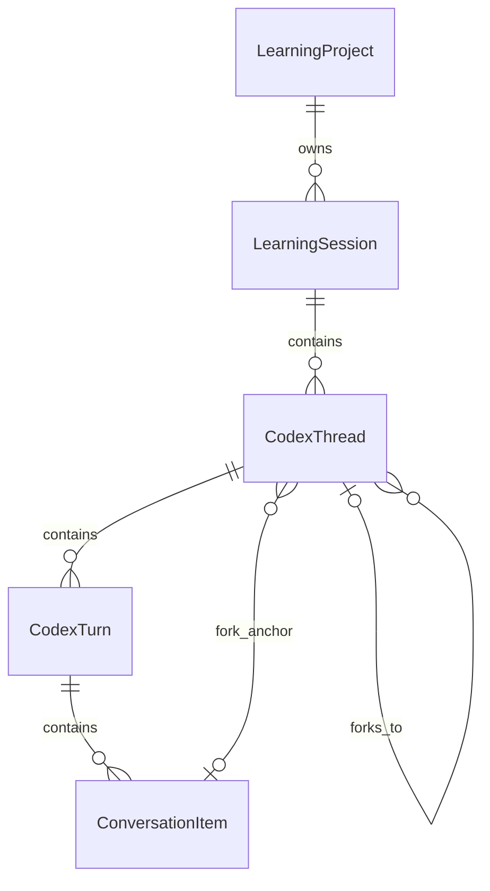
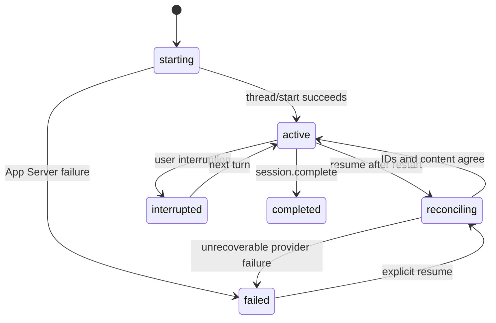

# Conversation Use Cases and Data Design

Status: Approved for implementation on 2026-07-19. Tracks GitHub Issue #6.

## 1. Scope and observable outcomes

This design implements the NIF-006 backend and typed Renderer contract. The concrete desktop
Renderer remains a separate deliverable. Success is observable when a caller can:

1. start a learning session and its first Codex thread;
2. send multiple turns while retaining the same learning-session and thread IDs;
3. resume the same Codex thread after an application restart without changing the learning-session ID;
4. fork at a completed item, automatically make the child thread active, and retain the parent;
5. interrupt an active turn while preserving confirmed items and unfinished user input;
6. replay typed events after a Renderer reload; and
7. reconcile local confirmed history with Codex history without silently overwriting conflicts.

The implementation uses Codex App Server 0.144.5 over stdio JSONL. The executable command is
injected. Tests use a fake stdio server; they do not require a logged-in account or network access.

## 2. Decisions

| Topic | Decision |
|---|---|
| Integration boundary | Codex Gateway plus typed local IPC; the concrete Renderer is out of this change. |
| Process contract | App Server executable is injected and verified with a fake stdio/JSONL server. |
| Authentication | App Server is assumed pre-authenticated. `account/read` without an account maps to `AUTH_REQUIRED`; login remains NIF-001. |
| Model configuration | `model` and reasoning effort are injectable. Omitted values are not sent, so App Server defaults apply. |
| Cardinality | Project 1-* LearningSession 1-* CodexThread 1-* CodexTurn 1-* ConversationItem. |
| Resume | Resuming the same thread preserves both LearningSession ID and Codex thread ID. |
| Fork boundary | Item-level. Only a completed public user or agent message can be an anchor. |
| Fork implementation | App Server only supports `lastTurnId`; exact item forks are rebuilt from confirmed history through the anchor using `thread/start` plus Responses API-compatible raw messages in `thread/inject_items`. Codex-internal execution state is not inherited. |
| Fork activation | The child becomes the active thread atomically after remote creation succeeds. |
| Renderer scope | Typed command/query/event contracts, production rendering, copy affordances, and responsive visual evidence are included. |
| Reconciliation | Match by Codex IDs. If notification IDs differ from `thread/read`, accept an alias only when exactly one item in the same turn has the same visible role, type, content, and order. Import only missing completed user/agent messages, never overwrite local content, and return `RECONCILIATION_CONFLICT` on divergence or ambiguity. |

## 3. Entity model

`LearningProject` does not own a single `codex_thread_id`. Thread identity belongs to
`CodexThread`. A session has exactly one active thread when conversation is available, while all
parent and sibling threads remain addressable for history.

### LearningSession

`id`, `project_id`, `lesson_id`, `active_thread_id`, `started_at`, `last_resumed_at`, `ended_at`,
`status`, `summary`, `next_action`

### CodexThread

`id`, `session_id`, `project_id`, `codex_thread_id`, `parent_thread_id`,
`forked_from_item_id`, `fork_mode`, `status`, `created_at`, `last_resumed_at`

`fork_mode=history_reconstruction` makes the loss of Codex-internal execution state explicit.
Only completed user and agent message items can be reconstructed losslessly with the non-experimental
0.144.5 contract. Provider-internal items are omitted from the reconstructable logical prefix; an
unsupported or hidden item cannot be selected as an anchor. Session/history responses expose `forkable`
on every public item so a Renderer can disable unsupported anchors before sending `thread.fork`.

### CodexTurn

`id`, `thread_id`, `session_id`, `project_id`, `codex_turn_id`, `request_id`, `input_text`,
`status`, `started_at`, `completed_at`

### ConversationItem

The existing `messages` table is the confirmed item store. It gains local `thread_id` and
`turn_id` foreign keys while retaining Codex thread/turn/item IDs for reconciliation. Streaming
deltas are events only; an item is durable only after `item/completed`.

Provider-internal reasoning may remain durable for reconciliation diagnostics, but Renderer-facing
session/history projections omit it and its completed event omits the reasoning content. Reconciliation
does not import provider-only reasoning records, preventing duplicate durable rows when notification and
`thread/read` identities differ.

`sequence` is an immutable ingestion cursor used by paginated history. `provider_order` is the
canonical order inside one Codex thread. Reconciliation may assign a newly discovered head or middle
item its provider position, but never renumbers an already issued history cursor. Thread display and
fork-prefix reconstruction use provider order; cursor replay uses immutable sequence.

At most one `pending` or `in_progress` Codex turn may exist for a Project across all of its sessions
and threads. `session.complete` is rejected while such a turn exists, and terminal sessions cannot be
reactivated through a fork. Provider items arriving after the local turn/session terminal boundary are
quarantined instead of being appended to confirmed history.

## 4. State transitions

## 5. I/O and transaction boundary

No App Server request is made while a database transaction is open. Operations use three phases:

1. read and validate local state in a short transaction;
2. call the gateway without a database transaction; and
3. apply the result in a new transaction, rechecking ownership and expected state.

Remote side effects are correlated with the local request ID. A remote success followed by a local
write failure is recovered through reconciliation, not by guessing that the remote action failed.
Provider operation state changes from `pending` to `inflight` immediately before I/O. A timeout or
disconnect is recorded as `uncertain` because the remote side effect may have happened; deterministic
validation failures become `failed`.

The stdio reader runs independently of requests and dispatches responses by JSON-RPC ID. Notifications
continue to drain after a response. The injected executable is resolved to an absolute path, receives
only an explicit environment, and runs outside the repository working directory; the initialized
user-agent version must match `0.144.5` exactly.

## 6. Event contract

Events have `sequence`, `name`, `occurred_at`, `request_id`, `project_id`, `session_id`,
`thread_id`, `turn_id`, `item_id`, and `payload`. Optional identifiers are omitted when not applicable.
The in-process event broker is bounded and monotonic. `conversation.events` returns a bounded page of
events after a sequence. IPC responses also have a fixed byte budget. Durable recovery uses paginated
session/history queries; event replay is not a durable event store.

## 7. Reconciliation rules

- Remote and local threads are matched by `codex_thread_id`.
- Turns and items are matched by their Codex IDs within that thread. When notification item IDs differ
  from `thread/read`, an alias is accepted only if exactly one item in the same turn matches role, type,
  visible content, and provider order; zero or multiple candidates fail closed.
- A missing remote completed item is inserted locally in provider order.
- A remote `inProgress` turn remains locally `in_progress`; it is never promoted to completed by import.
- Identical content is a no-op.
- A matching ID with different role, type, or content returns `RECONCILIATION_CONFLICT` and leaves
  local content unchanged.
- In-progress remote deltas are not imported as confirmed content.
- Unknown remote thread IDs are never attached to another project or session automatically.

## 8. Alternatives considered

### One thread per project

Rejected. It cannot represent independent learning sessions or forks and places provider identity on
the wrong aggregate.

### One thread per learning session without forks

Rejected. It matches the common path but cannot preserve alternative explorations.

### Round an item fork to the containing turn

Rejected because the selected requirement is an exact item boundary. It would silently include later
items from the same turn.

### Persist streaming deltas

Rejected for canonical history. Deltas may be duplicated or incomplete after interruption. Only
completed provider items are authoritative.

## 9. Deferred presentation and AI behavior

The typed Renderer contract does not by itself complete Markdown/table/math presentation, clipboard
interaction, grounding-backed return suggestions, or pedagogical steering quality. Those remain in
the hold register and must not be reported as implemented by backend contract tests.
